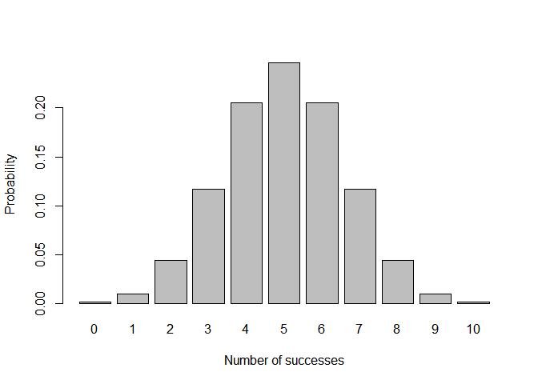
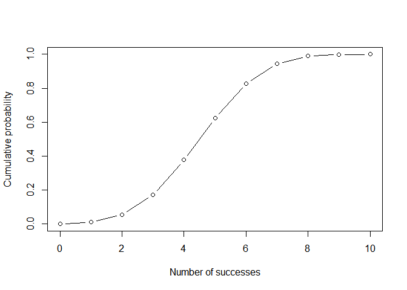

<!-- README.md is generated from README.Rmd. Please edit that file -->
Overview
========

<!-- badges: start -->
<!-- badges: end -->
`"Binomial"` is a R package that implements functions for calculating probabilities of a binomial random variable. It also allows for related calculations such as the probability distributuion, the expected value, the variance, and more.

Installation
------------

You can install the released version of binomial from [CRAN](https://CRAN.R-project.org) with:

``` r
install.packages("binomial")
```

The devlopment version is installed by:

``` r
install.packages("devtools")
devtools::install_github("stat133-sp19/hw-stat133-devnavani/blob/master/Workout03/binomial")
```

Example
-------

This is a basic example which shows you create a new binomial random variable.

``` r
library(binomial)
newRV = bin_variable(10, 0.5)
newRV
#> Binomial variable
#> 
#> Paramters
#> - number of trials:  10
#> - prob of success:  0.5
```

The summary statistics of this random variable can be found as well using the summary function.

``` r
sum = summary(newRV)
sum
#> Binomial variable
#> 
#> Paramters
#> - number of trials:  10
#> - prob of success:  0.5
#> 
#> Measures
#> 
#> - mean: 5
#> - variance: 2.5
#> - mode: 5
#> - skewness: 0
#> - kurtosis: -0.2
```

Plotting and Tables
-------------------

To make tables and plots representing a random variable, another class and function will be needed (one of bindis or bincum).

``` r
newRV = bin_distribution(10, 0.5)
df <- attr(newRV, "data")
df
#>    success  probability
#> 1        0 0.0009765625
#> 2        1 0.0097656250
#> 3        2 0.0439453125
#> 4        3 0.1171875000
#> 5        4 0.2050781250
#> 6        5 0.2460937500
#> 7        6 0.2050781250
#> 8        7 0.1171875000
#> 9        8 0.0439453125
#> 10       9 0.0097656250
#> 11      10 0.0009765625
```

``` r
plot(newRV)
```



``` r
newRV = bin_cumulative(10, 0.5)
df <- attr(newRV, "data")
df
#>    success         prob   cumulative
#> 1        0 0.0009765625 0.0009765625
#> 2        1 0.0097656250 0.0107421875
#> 3        2 0.0439453125 0.0546875000
#> 4        3 0.1171875000 0.1718750000
#> 5        4 0.2050781250 0.3769531250
#> 6        5 0.2460937500 0.6230468750
#> 7        6 0.2050781250 0.8281250000
#> 8        7 0.1171875000 0.9453125000
#> 9        8 0.0439453125 0.9892578125
#> 10       9 0.0097656250 0.9990234375
#> 11      10 0.0009765625 1.0000000000
```

``` r
plot(newRV)
#>    success         prob   cumulative
#> 1        0 0.0009765625 0.0009765625
#> 2        1 0.0097656250 0.0107421875
#> 3        2 0.0439453125 0.0546875000
#> 4        3 0.1171875000 0.1718750000
#> 5        4 0.2050781250 0.3769531250
#> 6        5 0.2460937500 0.6230468750
#> 7        6 0.2050781250 0.8281250000
#> 8        7 0.1171875000 0.9453125000
#> 9        8 0.0439453125 0.9892578125
#> 10       9 0.0097656250 0.9990234375
#> 11      10 0.0009765625 1.0000000000
```


