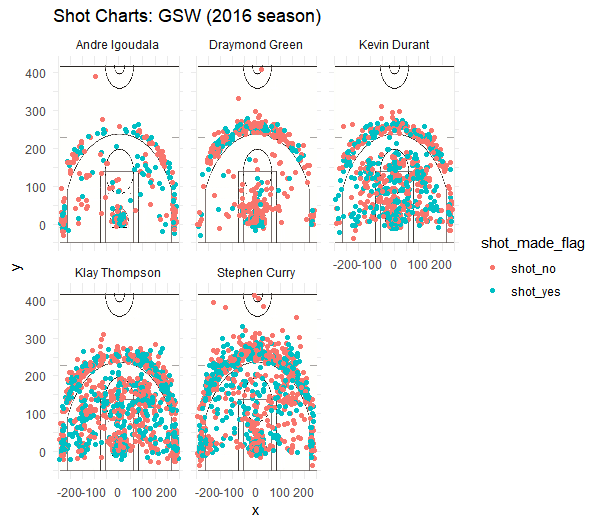

The Golden State Warriors' historically great shot profile
================


The Golden State Warriors have become one of the NBA's premier dynasties, a team that has been compared to some of the greatest of all time. That's what winning 73 games in one season, and capturing three NBA championships in four years will do for you. Along with having two former MVPs on the roster in the homegrown Stephen Curry and the superstar free agent signing Kevin Durant, the Warriors have a compelling case not only for the greatest team of all time but also the most talented team of all time. All stars guard Klay Thompson and forward Draymond Green are also featured in Golden State's starting lineup, and talented veteran role players like Andre iguodala and Shaun Livingston are a tremendous part of what makes the machine go in Oakland.

It is natural to ask why this has happened to Golden State specifically. What about the players and their skill-sets come together so effortlessly to produce some of the best basketball we've ever seen? Of course, having the two former MVPs is undoubtedly a massive help, but is there anything we can single out in terms of actual basketball play on the court to attempt to explain their transcendent greatness? The answer is simple - the efficiency and volume with which the Golden State Warriors shoot the ball has no other parallel to any other squad in NBA history. The success of a so-called "shooting team" completely contradicts what was previously thought about playoff basketball - that teams overly reliant on shooting can't win championships because defense gets tougher and the game gets slower in the playoffs. However, the magical shooting talent on the roster has transcended this conventional thought and has created arguably the best NBA team ever, as we will see in this report.

### Data

The data below represents the main targets of analysis for this report. It includes shot charts for each player, and tables for total shooting statistics, two point shooting statistics, and three point shooting statistics.

    ##             name total made perc_made
    ## 1   Kevin Durant   915  495 0.5409836
    ## 2 Andre Iguodala   371  192 0.5175202
    ## 3  Klay Thompson  1220  575 0.4713115
    ## 4  Stephen Curry  1250  584 0.4672000
    ## 5 Draymond Green   578  245 0.4238754

    ##             name total_2 made_2 perc_made_2
    ## 1 Andre Iguodala     210    134   0.6380952
    ## 2   Kevin Durant     643    390   0.6065319
    ## 3  Stephen Curry     563    304   0.5399645
    ## 4  Klay Thompson     640    329   0.5140625
    ## 5 Draymond Green     346    171   0.4942197

    ##             name total_3 made_3 perc_made_3
    ## 1  Klay Thompson     580    246   0.4241379
    ## 2  Stephen Curry     687    280   0.4075691
    ## 3   Kevin Durant     272    105   0.3860294
    ## 4 Andre Iguodala     161     58   0.3602484
    ## 5 Draymond Green     232     74   0.3189655



### Golden State's Shot Profile Analysis

For the Warriors, the name of the game is creating, taking, and making efficient shots. It starts with Stephen Curry, possibly the most deadly marksman the league has ever seen. Both him and his back-court mate Klay Thompson have shot over 40 percent from beyond the three point arc in our data, and 40 percent is generally an accepted benchmark for elite shooting. Thompson and Curry finished the year 10th and 15th on the three point percentage list, and were two of the only three players to appear in both the top 20 of three point percentage and top 20 in the most three point field goal attempts, according to basketball reference.

Can we quantify the incredible volume that these two shoot the three ball with? This volume can be seen from the shot chart, but let's supplement the shot chart with some numbers to do these players total justice.

``` r
curry_3PA_perc <- e_shooting_3pt[2,][2] / e_shooting[4,][2]
klay_3PA_perc <- e_shooting_3pt[1,][2] / e_shooting[3,][2]
durant_3PA_perc <- e_shooting_3pt[3,][2] / e_shooting[1,][2]
dray_3PA_perc <- e_shooting_3pt[5,][2] / e_shooting[5,][2]
iggy_3PA_perc <- e_shooting_3pt[4,][2] / e_shooting[2,][2]
c(curry_3PA_perc[1,][1],klay_3PA_perc[1,][1], durant_3PA_perc[1,][1], dray_3PA_perc[1,][1], iggy_3PA_perc[1,][1])
```

    ## [1] 0.5496000 0.4754098 0.2972678 0.4013841 0.4339623

The above values are the ratio of three point attempts to total shot attempts for Stephen Curry, Klay Thompson, Kevin Durant, Draymond Green, and Andre iguodala, respectively. Notice how the values for Curry and Thompson (0.55, 0.48) are much greater than the values for Durant, Green, and iguodala (0.30, 0.40, 0.43). This is a team that knows its strengths, and has a head coach in Steve Kerr that knows how to put his players in positions to succeed. These numbers confirm what we see on the court, that both Curry and Thompson take an inordinate amount of threes. It also confirms what we see on the shot chart, displayed above and again below for convenience.


Why is it so important that Steph Curry and Klay Thompson are launching so many threes at an elite efficiency rate? The answer is easy and intuitive - these shots are simply worth more than two pointers. These shots for these shooters, since both shoot over 40 percent, have an expected value per shot greater than 1.2 (3 \* 0.4). For perspective, only the greatest NBA offenses in history have generated roughly 1.15 points or higher per possession. These two, shooting threes the way that they do (volume + efficiency), blow other historically great NBA offenses out of the water.

Of course, at the highest level of professional basketball, offenses need to be balanced in their plan of attack. If opposing coaches knew that every time down the floor Curry or Thompson would jack up a three-pointer, he could coach his defense to be wary of this fact and the Warriors' effectiveness would drop. That is where the former MVP Kevin Durant comes into the picture.

As seen above, multi-time all star Kevin Durant's shot profile is much different than that of Curry or Thompson. From looking at the shot chart, it is apparent that he spends much more time in the mid range shooting two pointers than the two guards. We also see this from the numbers: Durant took by far the lowest proportion of his shots, only about 30%, from the three point arc when compared to his teammates, as seen above.

This is another important part in what makes the Warriors' offense so great because Durant makes them balanced. As seen in the table below, Durant actually leads these five players in total field goal percentage by a lot, meaning he is very skilled at putting the ball in the bucket from anywhere. When Curry and Thompson are being focused on to a larger extent than usual, Durant can punish the defense with his elite repertoire of two point shots. Durant is second on this list of players at two point shot percentage, at an all-star level number of 60%.

    ##             name total_2 made_2 perc_made_2
    ## 1 Andre Iguodala     210    134   0.6380952
    ## 2   Kevin Durant     643    390   0.6065319
    ## 3  Stephen Curry     563    304   0.5399645
    ## 4  Klay Thompson     640    329   0.5140625
    ## 5 Draymond Green     346    171   0.4942197

How do forwards Draymond Green and Andre Iguodala contribute to the Warriors' shooting profile. The best answer is that they know their roles and understand their strengths and weaknesses. Both players do not take many shots in the first place in comparsion to the three superstars Durant, Curry, and Thompson, as seen below.

Green takes 40 percent of his shots from three point range, while Iguodala takes 43 percent (compared to Curry's 55 percent and Thompson's 48 percent). Additionally, in examination of the shot charts, it is clear that both Green and Iguodala take the highest proportion of their shots near the basket or from three compared to the other three players. This is key because they understand that these are the most efficient shots, and especially for shooters like them who are not so great, they have to be quite discriminating in the shots they choose to launch.

    ##             name total made perc_made
    ## 1   Kevin Durant   915  495 0.5409836
    ## 2 Andre Iguodala   371  192 0.5175202
    ## 3  Klay Thompson  1220  575 0.4713115
    ## 4  Stephen Curry  1250  584 0.4672000
    ## 5 Draymond Green   578  245 0.4238754

    ## [1] 0.5496000 0.4754098 0.2972678 0.4013841 0.4339623


### The Answer: Elite Skill and Team Chemistry

Rarely is there one simple answer that explains such a complex question like that of how the Warriors became a historically great offense. From the charts, data, and analysis above, we can come to some significant conclusions. The elite shooting of backourt players Curry and Thompson exists in perfect harmony with Durant's top-level shot-making skill. Meanwhile, Green and Iguodala continue making good decisions about when and where to shoot the ball from, sacrificing their own stats for the betterment of the team.

### References

-   <https://www.basketball-reference.com/leagues/NBA_2017_leaders.html>
